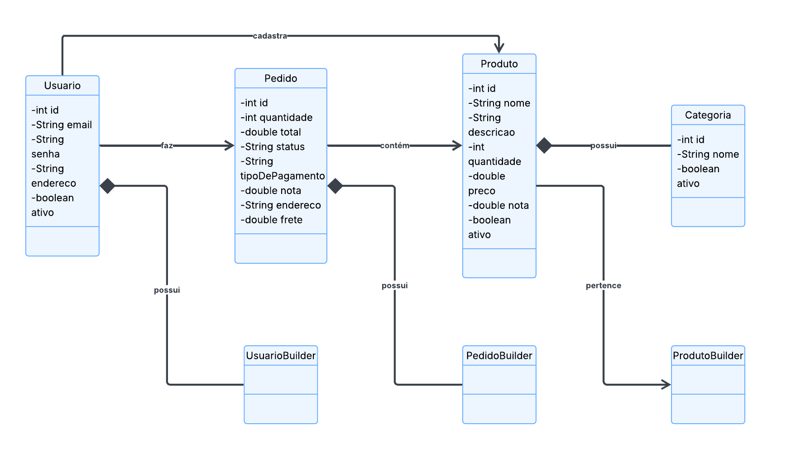
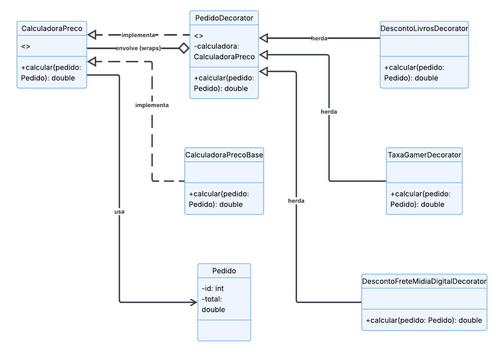
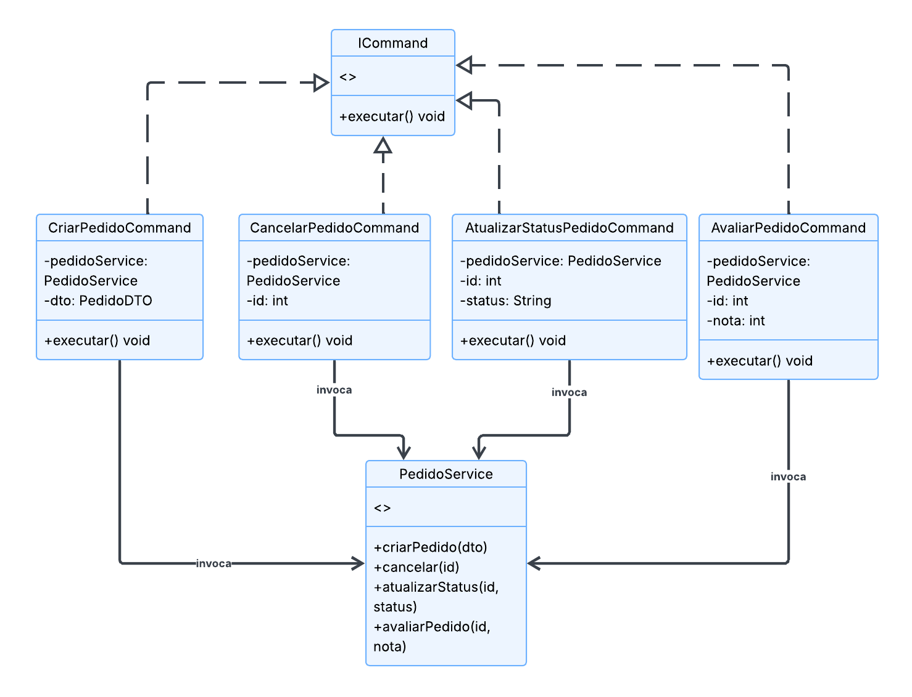
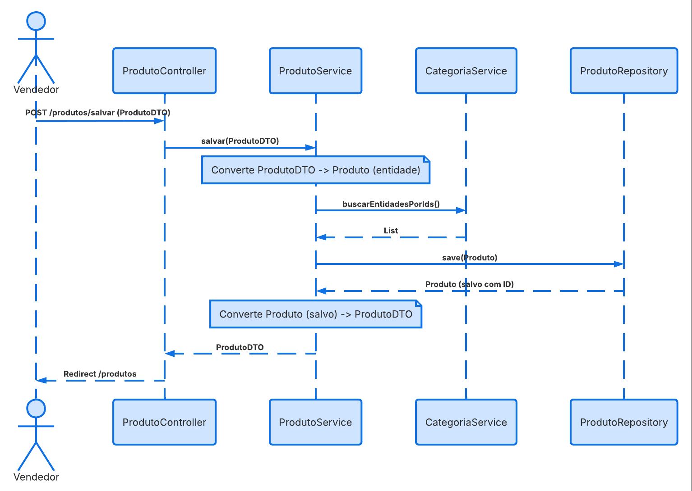
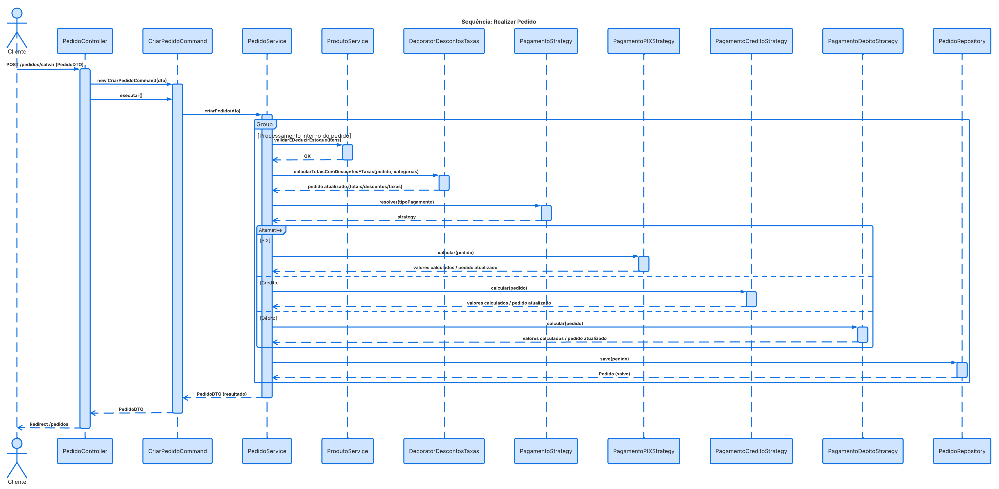

# E-Commerce App

Sistema de e-commerce construído com Java e Spring Boot. Este projeto tem foco na implementação de boas práticas de design de software, utilizando **Padrões de Projeto (Design Patterns)** e refatorações baseadas em regras de **Object Calisthenics**.

## 🚀 Funcionalidades

*   **Autenticação e Usuários**: Cadastro de usuários, autenticação via sessão.
*   **Gestão de Produtos**: CRUD de produtos, controle de estoque integrado, suporte a múltiplas categorias por produto e avaliação de produtos (notas de 0 a 10).
*   **Gestão de Categorias**: Criação e listagem de categorias de produtos.
*   **Gestão de Pedidos**: 
    *   Criação de novos pedidos com baixa automática de estoque.
    *   Simulação de meios de pagamento (Pix, Crédito, Débito) com descontos específicos.
    *   Cálculo dinâmico de taxas e descontos baseado na categoria dos produtos.
    *   Alteração de status, cancelamento e avaliação de pedidos.

## 🛠 Tecnologias

*   **Java 24**
*   **Spring Boot (Web, Data JPA, Thymeleaf)**
*   **MySQL** (Banco de dados relacional)
*   **Maven** (Gerenciamento de dependências)
*   **HTML/CSS** (Templates estáticos via Thymeleaf)

## 🧩 Padrões de Projeto Utilizados

1.  **Decorator (Obrigatório)**: Utilizado no cálculo do total do pedido. A interface `CalculadoraPreco` é envolvida por classes como `DescontoLivrosDecorator` e `TaxaGamerDecorator`, que aplicam lógicas dinâmicas de preço dependendo da categoria do produto no momento da compra.
2.  **Strategy**: Implementado para o cálculo e resolução do método de pagamento. A interface `Pagamento` possui estratégias como `PagamentoPix`, `PagamentoCredito` e `PagamentoDebito`, permitindo extensibilidade sem usar cadeias infinitas de `if/else`.
3.  **Command**: Usado na camada de apresentação (Controllers) para interagir com o `PedidoService`. A interface genérica `ICommand` encapsula intenções do usuário (`CriarPedidoCommand`, `CancelarPedidoCommand`), separando o invocador da lógica de negócio executada.
4.  **Builder**: Aplicado em múltiplas entidades complexas do domínio (`Produto`, `Pedido`, `Usuario`) para facilitar a instanciação de objetos consistentes sem sobrecarregar construtores longos (Telescoping Constructor Anti-Pattern).
5.  **MVC (Model-View-Controller)**: Padrão arquitetural padrão do framework Spring.

---

## 🏗 Diagramas de Classes

### 1. Modelos de Domínio

### 2. Padrão Decorator (Cálculo de Preços)

### 3. Padrão Command (Ações de Pedido)

---

## 🔄 Diagramas de Sequência

### Cadastrar Produto

### Realizar Pedido
